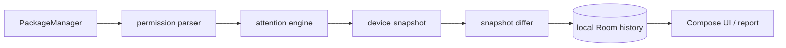

<div align="center">


<br>

<a href="https://github.com/vazovsky17/PermAware"></a>


<br><br>

**I build mobile products where platform constraints become part of the design.**<br>
Android is home ground. iOS is the next native surface. Shared logic belongs in KMP; private data belongs on the device.

<br>

<a href="https://t.me/vazovsky17"></a>
<a href="mailto:vazovsky.app@gmail.com"></a>
<a href="https://www.linkedin.com/in/vazovsky17"></a>

</div>

<br>

## `01 // current signal` — PermAware

### Your apps have permissions. PermAware makes them visible.

[**PermAware**](https://github.com/vazovsky17/PermAware) is a privacy-focused Android app that audits installed apps, explains access to the camera, microphone, location and contacts, and shows **what changed since the previous scan**.

It is deliberately incapable of uploading that inventory: there is no account, backend, analytics or advertising SDK — and the release manifest contains **no `INTERNET` permission**.

- inspect requested and actually granted permissions;
- detect supported special access and explain unknown states honestly;
- compare snapshots and keep a local change history;
- export a report only through an explicit system share action;
- run entirely on-device, with Room as the private source of truth.

| Network access | Measured scan | Test matrix | Release |
| :-- | :-- | :-- | :-- |
| **No permission** | **473 packages in ~1.5 s** | **81 JVM + 113 device** | **v1.0.0 · 4.2 MB APK** |

`minSdk 28` · `targetSdk 36` · `Kotlin` · `Jetpack Compose` · `Material 3` · `RU / EN`



The domain layer is plain Kotlin; Android framework types stop at `data/platform`. That keeps the attention engine, snapshot diffing and report generation fast to test on the JVM, while device tests validate the platform boundaries. The result is **81 JVM tests + 113 device tests**, clean lint and ktlint, and a reproducible CI build.

<p>
  <a href="https://github.com/vazovsky17/PermAware/releases/latest/download/app-release.apk"></a>
  <a href="https://github.com/vazovsky17/PermAware"></a>
  <a href="https://github.com/vazovsky17/PermAware/releases/tag/v1.0.0"></a>
</p>

> PermAware is an inspector, not an antivirus or a fear score. A permission is context, not a verdict.

<br>

## `02 // product lab` — Vazie

**Vazie** is my local-first product lab: focused apps, native interfaces and no pressure to turn every useful tool into a social platform.

| Build | Signal | Engineering focus |
| :-- | :-- | :-- |
| **VPN** | Bring your own configuration | Android networking, secure local storage |
| **Rhythm** | Medication schedules and habits | Offline state, reliable reminders |
| **Keep** | Password manager for `kdbx` vaults | Files stay where the user puts them |
| **Letter** | Email without a feed | Calm information architecture |
| **[Relay](https://github.com/vazovsky17/VazieRelay)** | Android ↔ iOS device link | Kotlin Multiplatform core, native UI on both sides |

<p>
  <a href="https://github.com/vazovsky17/vazovsky17/releases/latest/download/VazieVPN.apk"></a>
  <a href="https://github.com/vazovsky17/VazieRelay"></a>
  <a href="https://t.me/vazieapp"></a>
</p>

<br>

## `03 // engineering profile`

| Native mobile | Shared systems | Delivery |
| :-- | :-- | :-- |
| Kotlin · Jetpack Compose · Android SDK | Kotlin Multiplatform · Coroutines · Flow | Gradle · GitHub Actions · signed releases |
| Swift · SwiftUI · Apple SDKs | Room · Ktor · offline-first data | Docker · Linux · VPS infrastructure |
| Material 3 · adaptive UI | MVVM · clean boundaries · DI with Hilt | JVM · instrumentation · UI testing |

```kotlin
val approach = MobileEngineering(
    ui = Native(platform = currentPlatform),
    core = Shared(onlyWhenItActuallyHelps),
    data = LocalFirst,
    quality = Tests + MeasuredPlatformBehavior
)
```

I care about the parts that survive the demo: state ownership, failure modes, background limits, migrations, signing, release automation and interfaces that still make sense six months later.

<br>

## `04 // telemetry`

<p>
  
  
  
</p>

Public work is the visible edge of a larger private monorepo. Projects move into the open when their architecture, build and documentation are ready to be useful outside my machine.

<br>

---

<div align="center">

### Building something that needs to feel native on both sides?

Android, iOS, local-first architecture or a product that should expose less data — tell me what you are working on.

<a href="https://t.me/vazovsky17"></a>

<br><br>

`Saratov · UTC+4` &nbsp; `available via Telegram or email`

</div>
