<div align="center">



<br>


<br>

<a href="https://t.me/vazovsky17"></a>
<a href="mailto:vazovsky.app@gmail.com"></a>
<a href="https://www.linkedin.com/in/vazovsky17"></a>

</div>

<br>

## About

Android developer based in Saratov. Kotlin is home ground — Jetpack Compose, coroutines and Flow, Room, Hilt, and architecture that still makes sense six months later.

Right now I'm widening that into proper mobile engineering: **learning iOS** with Swift, SwiftUI and Apple's SDKs. Shared logic goes into **Kotlin Multiplatform**, the UI is written twice — once per platform — instead of hiding the differences behind a cross-platform layer. Backend and infrastructure come along when a product needs them: Ktor, Docker, a Linux VPS, GitHub Actions doing the boring parts.

Most of it ends up inside **Vazie**, my own small ecosystem of local-first apps.

<br>

## Stack

**Mobile**

<p>
  &nbsp;&nbsp;&nbsp;
  &nbsp;&nbsp;&nbsp;
  &nbsp;&nbsp;&nbsp;
  &nbsp;&nbsp;&nbsp;
  
</p>

**Architecture &amp; data**

`Kotlin Multiplatform` `Coroutines` `Flow` `Room` `Hilt` `MVVM` `Clean Architecture`

**Backend &amp; infra**

<p>
  &nbsp;&nbsp;&nbsp;
  &nbsp;&nbsp;&nbsp;
  &nbsp;&nbsp;&nbsp;
  
</p>

**Tools**

<p>
  &nbsp;&nbsp;&nbsp;
  &nbsp;&nbsp;&nbsp;
  &nbsp;&nbsp;&nbsp;
  &nbsp;&nbsp;&nbsp;
  
</p>

<br>

## Vazie

Five small apps — each solving one problem instead of trying to become everything. Local-first, private by design, built by one developer with no investors and no growth pressure. **Nothing is on the app stores yet**; early builds ship straight from this account, and the parts that can be built in the open are.

| App | What it does |
| :-- | :-- |
| **VPN** | A VPN client that runs your own configs today; accounts and subscriptions come later. Android build below |
| **Rhythm** | Medication schedules and habits, tracked on the device — a rebuild of Healsted, my diploma project |
| **Keep** | Password manager for `kdbx` vaults — the file stays where you put it |
| **Letter** | An email client — plain mail, no feed and no promotions tab |
| **[Relay](https://github.com/vazovsky17/VazieRelay)** | Device-to-device link between Android and iOS — Kotlin Multiplatform core, native UI on both. Bootstrap stage |

<p>
  <a href="https://github.com/vazovsky17/vazovsky17/releases/latest/download/VazieVPN.apk"></a>
  <a href="https://github.com/vazovsky17/VazieRelay"></a>
  <a href="https://t.me/vazieapp"></a>
</p>

<br>

## GitHub

<p>
  
  
  
</p>

Vazie ships from this account. Most of it still lives in a private monorepo — what can be opened gets opened here, like [**VazieRelay**](https://github.com/vazovsky17/VazieRelay).

<br>

## Contact

- **Work** — [vazovsky.app@gmail.com](mailto:vazovsky.app@gmail.com)
- **Telegram** — [@vazovsky17](https://t.me/vazovsky17)
- **LinkedIn** — [vazovsky17](https://www.linkedin.com/in/vazovsky17)

<br>

---

<div align="center">

**Got something that has to run well on both Android and iOS?**<br>
Tell me what it is — I answer fastest on Telegram.

<a href="https://t.me/vazovsky17"></a>

</div>

```console
$ adb devices && xcrun simctl list devices booted
2 devices attached · 1 developer · 0 shared codebases
```
