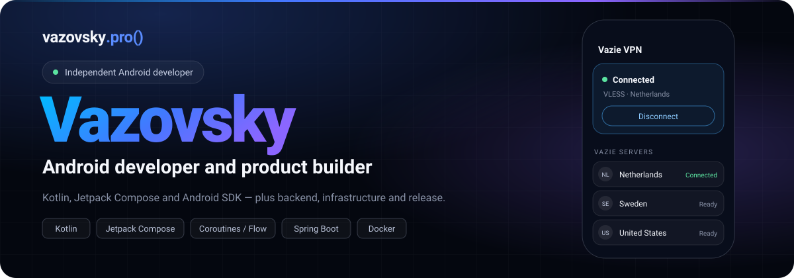

 

  

**Пишу на Kotlin, Jetpack Compose и Android SDK.** 
Делаю не только интерфейс приложения, но и backend, инфраструктуру, релиз и публикацию. 
Создаю собственные продукты.

 

**[Больше о проектах на vazovsky.pro →](https://vazovsky.pro)**

 

`ГЛАВНЫЙ ПРОЕКТ · СОБСТВЕННЫЙ ПРОДУКТ`

## [Vazie](https://vazie.app) — собственная экосистема local-first приложений

Vazie — мой собственный продукт: небольшая экосистема приложений, в которых данные остаются на устройстве, а аккаунт не обязателен. Первый выпущенный продукт — **[Vazie VPN](https://github.com/vazovsky17/VazieVPN)**, нативный Android-клиент для VLESS.

  
  
  
  

| Продукт | О чём | Статус |
| :-- | :-- | :-- |
| **[Vazie VPN](https://github.com/vazovsky17/VazieVPN)** | VPN-клиент для своей конфигурации VLESS | **Выпущен · v1.0.0** |
| **[Vazie Keep](https://github.com/vazovsky17/VazieKeep)** | Менеджер паролей для файлов `.kdbx` | Скоро |
| **[Vazie Relay](https://github.com/vazovsky17/VazieRelay)** | Файлы между своими устройствами по локальной сети | Ранняя стадия |
| **[Vazie Rhythm](https://github.com/vazovsky17/VazieRhythm)** | Привычки и рутины, всё хранится локально | Концепт |
| **[Vazie Letter](https://github.com/vazovsky17/VazieLetter)** | Спокойный почтовый клиент | Концепт |

Правило экосистемы простое: бесплатная версия работает без аккаунта, данные остаются у пользователя, а платными делаются только возможности, для которых нужен работающий сервис.

 

`КЕЙСЫ`

## Что именно я делала в этих продуктах

Собственные проекты, которые можно открыть и проверить: код на GitHub, дизайн-кейсы на Behance. Без клиентских логотипов и цифр, которые нельзя подтвердить.

### 01 · Vazie VPN — нативный Android VPN-клиент

`Выпущен · v1.0.0` · `APK на vazie.app`

> **Задача.** У человека уже есть ссылка `vless://` от своего или арендованного сервера. Нужен клиент, который поднимет через неё туннель без аккаунта и рекламы — и честно скажет, если соединение не работает.

**Что сделала:** весь продукт — Android-приложение, backend на Kotlin, сайт и серверы для платного тарифа VPN Plus.

- 23 Gradle-модуля; границы между ними проверяет convention-плагин на каждой сборке
- После подключения приложение отдельно проверяет пакеты, DNS и TLS и показывает, что именно не работает
- Конфигурации зашифрованы ключом из Android Keystore, системный бэкап отключён
- CI вскрывает release-APK и останавливает сборку, если внутри нашёлся секрет или отладочный инструмент

`Kotlin` `Compose · Material 3` `Glance` `Hilt` `Ktor` `libXray` `Robolectric` `GitHub Actions`

[Страница продукта ↗](https://vazie.app/vpn) &nbsp;·&nbsp; [Код на GitHub ↗](https://github.com/vazovsky17/VazieVPN) &nbsp;·&nbsp; [Кейс на Behance ↗](https://www.behance.net/gallery/256711563/Vazie-VPN-Native-Android-VPN-Client)

 

### 02 · PermAware — Android-утилита для приватности

`Опубликован в RuStore · v1.0.0`

> **Задача.** Трудно понять, к каким данным и функциям устройства имеют доступ установленные приложения. Отдавать такой список на чужой сервер ради ответа — плохая идея.

**Что сделала:** приложение целиком — от разбора разрешений до публикации и прохождения проверки в RuStore.

- Анализ выполняется только на устройстве, результаты никуда не отправляются
- Разрешения читаются через стандартные Android API, настройки других приложений не меняются
- Экспорт отчёта в текст или JSON через системное меню «Поделиться»

`Kotlin` `Jetpack Compose` `Android API`

[RuStore ↗](https://www.rustore.ru/catalog/app/app.vazovsky.permaware) &nbsp;·&nbsp; [Код на GitHub ↗](https://github.com/vazovsky17/PermAware) &nbsp;·&nbsp; [Кейс на Behance ↗](https://www.behance.net/gallery/256712279/PermAware-Android-Privacy-Audit)

 

### 03 · Экосистема Vazie — общая основа для нескольких приложений

`Выпущен один продукт из пяти`

> **Задача.** Несколько приложений должны выглядеть и вести себя одинаково, но работать независимо: каждое полезно само по себе и ничего не требует от остальных.

**Что сделала:** продуктовую модель, сайт [vazie.app](https://vazie.app), общий аккаунт и правила монетизации. VPN — первое приложение, где всё это собрано целиком. Vazie Relay строится на Kotlin Multiplatform с нативным интерфейсом на Android и iOS.

`Kotlin` `Kotlin Multiplatform` `Jetpack Compose` `SwiftUI`

 

`СТЕК`

## С чем я работаю

| Android | Архитектура · данные и сеть | Тесты и релиз | Backend и iOS |
| :-- | :-- | :-- | :-- |
| Kotlin | MVVM · Clean Architecture | JUnit · Robolectric | Backend на Kotlin |
| Jetpack Compose · Material 3 | Многомодульные проекты | Compose UI tests | Spring Boot · PostgreSQL |
| Coroutines / Flow | Hilt · Gradle convention-плагины | GitHub Actions · R8 | Docker |
| Navigation · Glance · VpnService | Room · DataStore · Ktor | Подпись и release-сборки | Swift / SwiftUI |
| Android SDK | Firebase · Android Keystore | Google Play · RuStore | Kotlin Multiplatform |

Backend и iOS — пока только в собственных проектах, и я говорю об этом честно.

 

`КОММЕРЧЕСКИЙ ОПЫТ`

## В Android-разработке с 2022 года

| Период | Компания | Что делала |
| :-- | :-- | :-- |
| янв 2024 — авг 2026 | **Жили Были** | Самостоятельно вела Android-направление нескольких коммерческих проектов: архитектура, оценка задач, разработка с нуля, поддержка, code review и релизы |
| сен 2023 — фев 2024 | **Sandbox Development** | Параллельно с основной работой с нуля разработала коммерческое Android-приложение: от архитектуры до интеграции с backend |
| апр 2023 — авг 2023 | **Smartway** | Миграция коммерческого приложения с React Native на нативный Android |
| фев 2022 — мар 2023 | **Heads and Hands** | Feature-команда приложения «Спортмастер»: трекер физической активности, Google Fit, unit-тесты |

 

---

### Связаться

Сайт, проекты и контакты — на [vazovsky.pro](https://vazovsky.pro). Быстрее всего — в Telegram.

**[Написать в Telegram →](https://t.me/vazovsky17)**

  

[vazovsky.pro](https://vazovsky.pro) &nbsp;·&nbsp; [@vazovsky17](https://t.me/vazovsky17) &nbsp;·&nbsp; [vazovsky.hub@gmail.com](mailto:vazovsky.hub@gmail.com) &nbsp;·&nbsp; [Behance](https://www.behance.net/vazovsky17) &nbsp;·&nbsp; [vazie.app](https://vazie.app)

